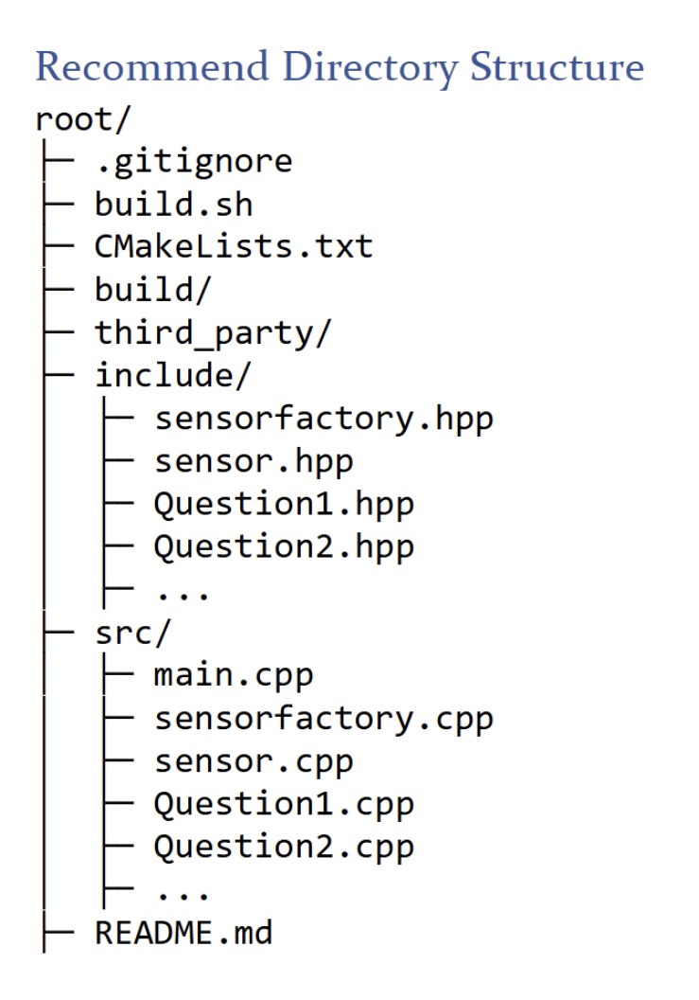

# AERSP 424 HW 2
Authors: Conor & Gabrielle Dowdell

Questions 1-3: source/main_1-3.cpp
Question 4: source/main_4.cpp
How to run:
1. Build using Gear in bottom left
2. Compile program using play button in bottom left
3. Close all figures after compilation
4. Open HW2/Build/Output/Debug and run "homework02 application" 

